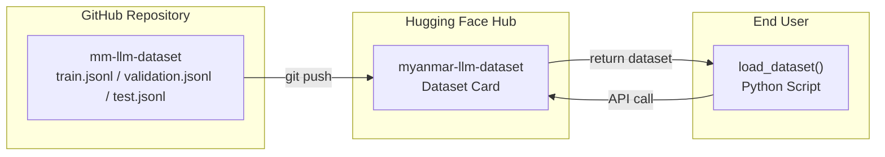
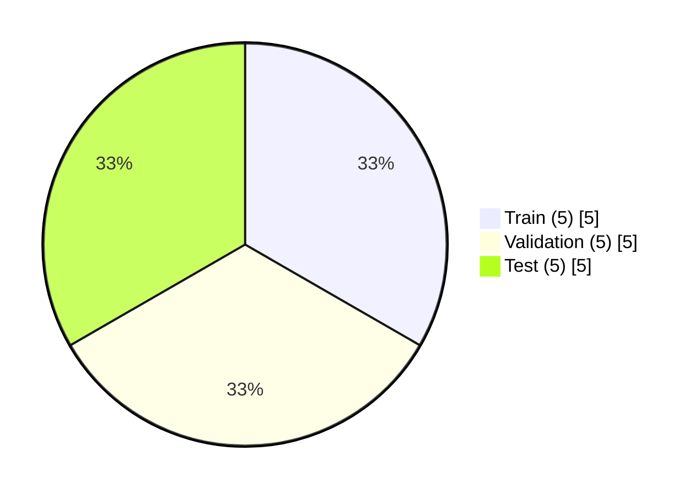
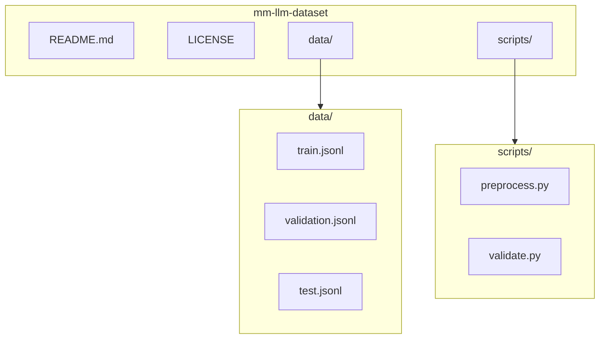

# 🇲🇲 Myanmar LLM Dataset


<p align="center">
  
</p>


<p align="center">
  <strong>မြန်မာဘာသာစကား Large Language Model အတွက် Supervised Fine-Tuning (SFT) Dataset</strong>
</p>


<p align="center">
  <a href="#license"></a>
  <a href="#"></a>
  <a href="#"></a>
</p>


---


## 📖 ခြုံငုံသုံးသပ်ချက်


ဤ dataset သည် မြန်မာဘာသာစကားဖြင့် လေ့ကျင့်သင်ကြားထားသော **Large Language Model (LLM)** များကို **Supervised Fine-Tuning (SFT)** ပြုလုပ်ရန်အတွက် တည်ဆောက်ထားခြင်းဖြစ်ပါသည်။





---


📊 ဒေတာပါဝင်မှု အချိုးအစား


ခွဲခြမ်း နမူနာအရေအတွက် ရှင်းလင်းချက်
Train ၅ မော်ဒယ်အား သင်ကြားရန်
Validation ၅ သင်ကြားနေစဉ် စမ်းသပ်ရန်
Test ၅ အဆုံးသတ် အကဲဖြတ်ရန်





---


📁 ဖိုင်ပုံစံ (JSONL)


```jsonl
{"messages": [{"role": "system", "content": "သင်သည် အထောက်အကူပြု AI လက်ထောက်တစ်ဦးဖြစ်သည်။"}, {"role": "user", "content": "မင်္ဂလာပါ"}, {"role": "assistant", "content": "မင်္ဂလာပါ။ ဘယ်လိုကူညီရမလဲ"}], "metadata": {"source": "manual", "language": "my"}}
```


အဓိက အစိတ်အပိုင်းများ


Key Type Description
messages array စကားဝိုင်း အပိုင်းအစများ
role string system / user / assistant
content string စကားဝိုင်း အကြောင်းအရာ
metadata object နောက်ဆက်တွဲ အချက်အလက်


---


🚀 အသုံးပြုနည်း


Hugging Face datasets ဖြင့်


```python
from datasets import load_dataset


# dataset တစ်ခုလုံး load လုပ်ရန်
dataset = load_dataset("amkyawdev/myanmar-llm-dataset")


# split တစ်ခုချင်းစီ load လုပ်ရန်
train = load_dataset("amkyawdev/myanmar-llm-dataset", split="train")
valid = load_dataset("amkyawdev/myanmar-llm-dataset", split="validation")
test = load_dataset("amkyawdev/myanmar-llm-dataset", split="test")
```


GitHub Raw URL ဖြင့်


```python
from datasets import load_dataset


dataset = load_dataset(
    "json",
    data_files="https://raw.githubusercontent.com/amkyawdev/myanmar-llm-dataset/main/data/processed/train.jsonl"
)
```


---


📂 Project Structure





---


📜 လိုင်စင်


ဤ project သည် MIT License အောက်တွင် ဖြန့်ချိထားပါသည်။


```
MIT License


Copyright (c) 2024 Am Kyaw Dev


Permission is hereby granted, free of charge, to any person obtaining a copy
...
```


---


🤝 ပါဝင်ကူညီခြင်း


ဤ dataset ကို ပိုမိုကောင်းမွန်အောင် ပူးပေါင်းပါဝင်လိုပါက Pull Request သို့မဟုတ် Issue ဖွင့်နိုင်ပါသည်။


---


<p align="center">
  Made with ❤️ for Myanmar NLP Community
</p>
